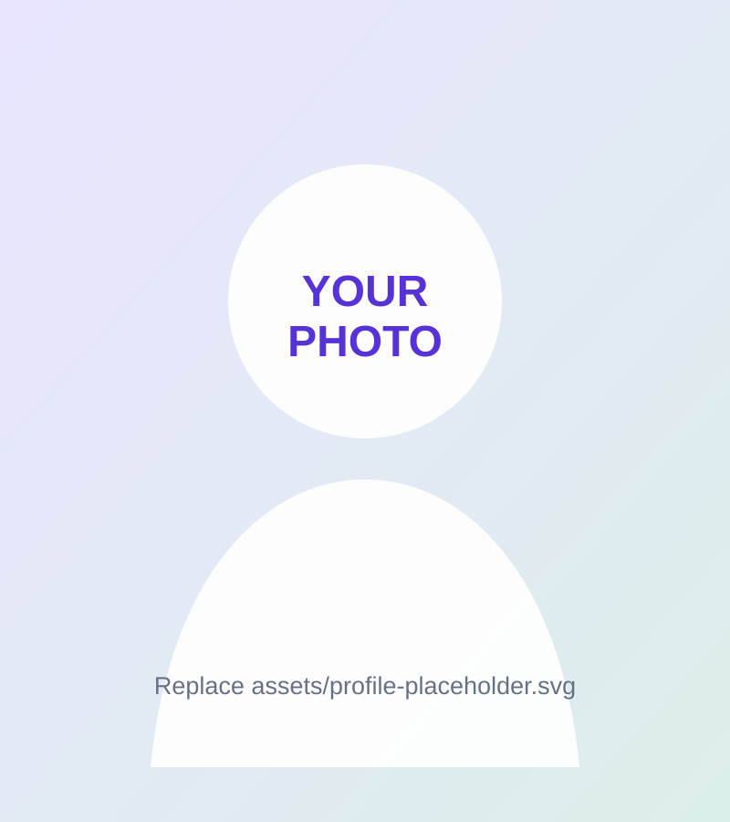

# Shreya Ghosh — Research Portfolio

A lightweight, professional academic portfolio designed for **GitHub Pages**.

## Why this version

- No Hugo / Wowchemy / Jekyll maintenance required.
- Plain HTML + CSS + JavaScript.
- Fast and responsive.
- Easy to edit directly on GitHub.
- Publications are maintained in one file: `data.js`.
- Works both as a user site (`username.github.io`) and a project site.

## Files

```text
.
├── index.html
├── styles.css
├── script.js
├── data.js
├── assets/
│   └── profile-placeholder.svg
└── README.md
```

## 1. Personalize before publishing

### Replace profile image
Put your image inside `assets/`, for example:

```text
assets/shreya.jpg
```

Then in `index.html` change:

```html

```

to:

```html

```

### Update links
Search `index.html` for:
- `https://scholar.google.com/`
- `https://github.com/`
- `YOUR_EMAIL@iitbbs.ac.in`
- the CV `href="#"`

Replace each with your real URL/email.

### Update publications
Edit only `data.js`. Copy an existing publication object and change the fields.

## 2. Publish from your active GitHub account

### Recommended: your main personal site

If your active GitHub username is `myusername`, create a public repository named:

```text
myusername.github.io
```

Upload all files from this folder to the **root** of the repository.

Then go to:

**Repository → Settings → Pages → Build and deployment → Deploy from a branch → `main` → `/ (root)`**

Your site will appear at:

```text
https://myusername.github.io/
```

### Alternative: keep a normal repository name

If the repository is called `portfolio`, GitHub Pages can publish it at:

```text
https://myusername.github.io/portfolio/
```

This codebase uses relative asset paths, so it works in either mode.

## 3. Push using Git

```bash
git init
git add .
git commit -m "Initial research portfolio"
git branch -M main
git remote add origin https://github.com/YOUR_USERNAME/YOUR_USERNAME.github.io.git
git push -u origin main
```

## Suggested next edits

1. Add your real portrait.
2. Put actual Scholar, ORCID, DBLP, GitHub, LinkedIn and CV links.
3. Add PDF/code/project links in `data.js`.
4. Expand the News section.
5. Add funded-project cards if you want a Grants/Funding section.
6. Add a downloadable CV PDF in `assets/`.

## Notes

The current content is a curated starter version. Please verify venue names, author ordering, and URLs before making the site public.
